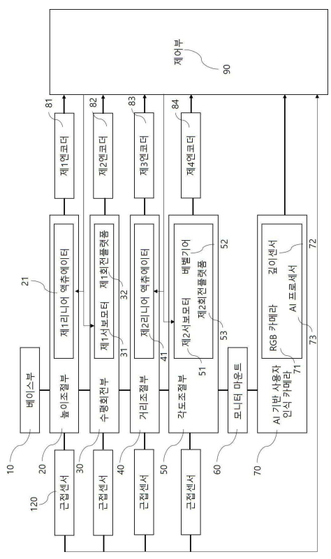
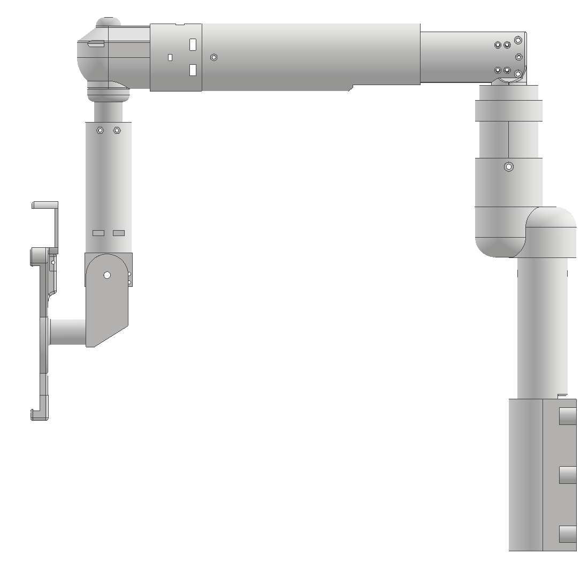
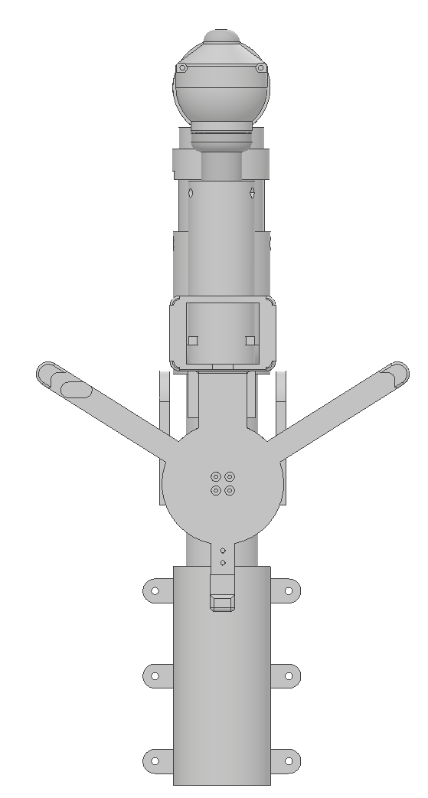
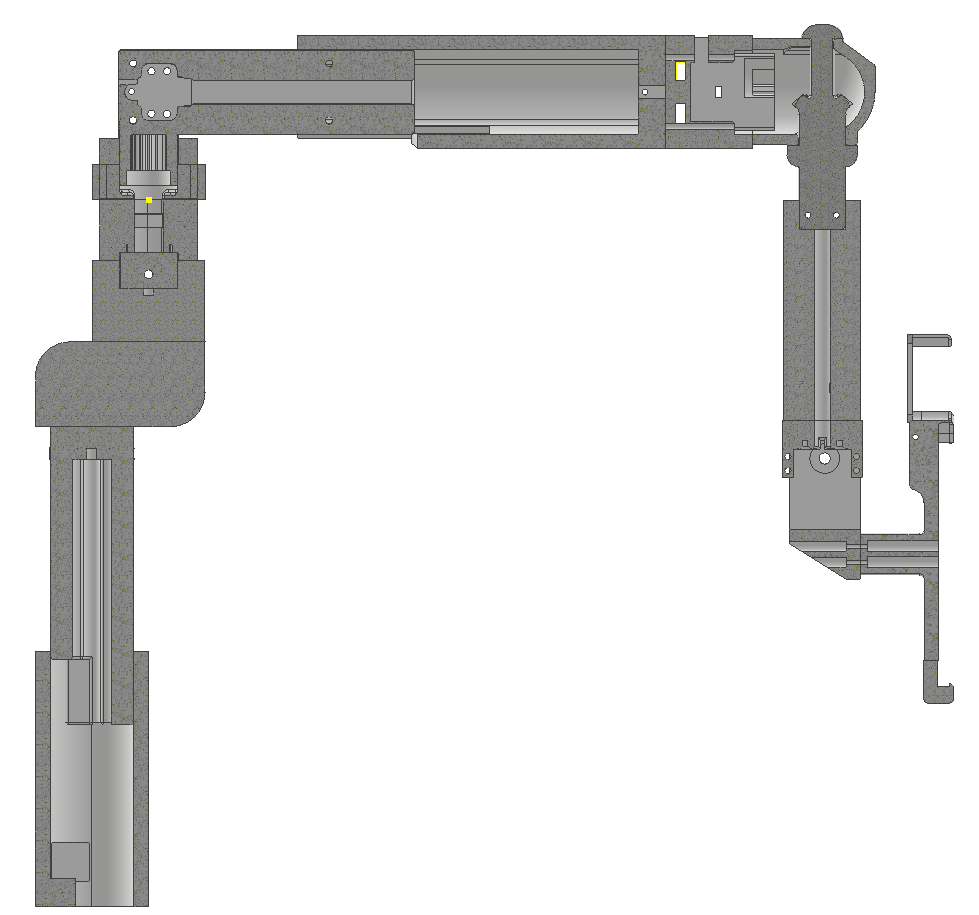
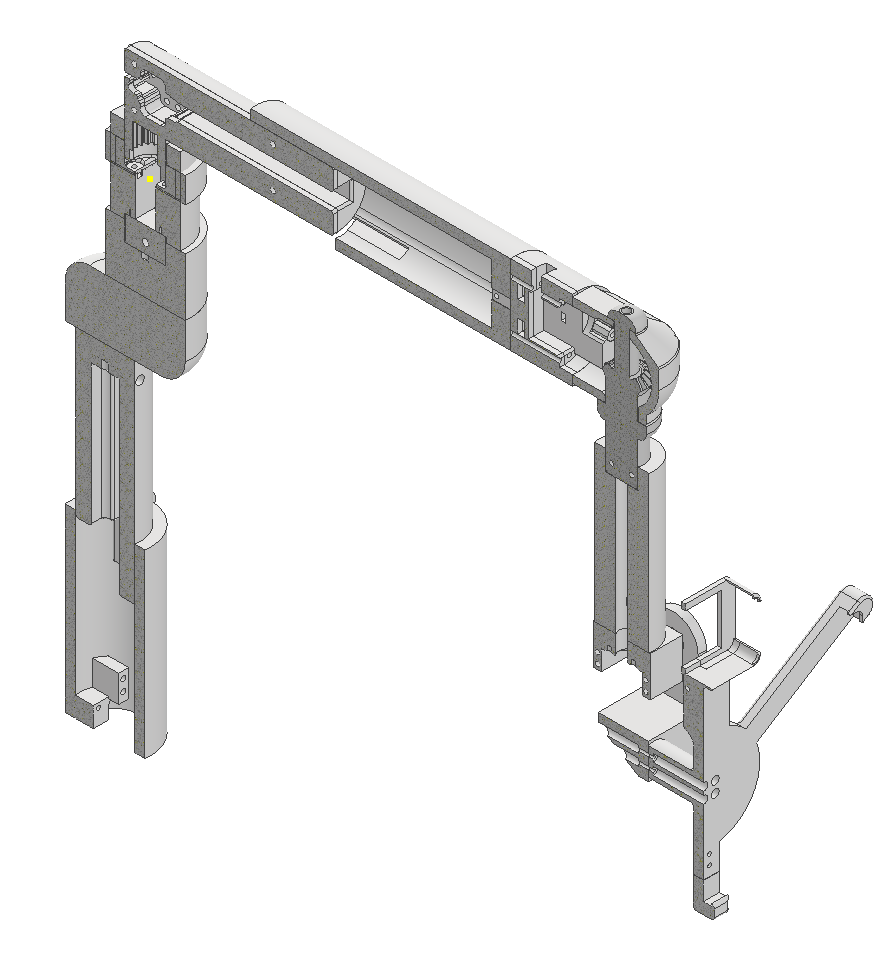

# AI Smart Monitor Arm

## AI 인식 기반 자율 제어 기능의 지능형 모니터 암

사용자의 얼굴, 자세 및 위치 변화를 인식하고 모니터의 높이, 거리, 회전 및 각도를 자동으로 조절할 수 있도록 설계한 **AI 기반 지능형 모니터 암** 프로젝트입니다.

본 프로젝트는 기계공학 졸업작품으로 진행되었으며, **기계 구동 메커니즘, 센서 기반 제어, 사용자 인식 기술을 하나의 메카트로닉스 시스템으로 통합**하는 것을 목표로 하였습니다.

설계 및 개발 결과를 기반으로  
**「AI 인식 기반 자율 제어 기능의 지능형 모니터 암」 특허를 출원하였습니다.**

---

## Project Preview

### Overall Design


### System Architecture



---

## 1. Project Overview

기존 모니터 암은 사용자가 직접 모니터의 위치와 각도를 조절해야 하므로 사용자의 자세나 위치가 변화할 때마다 반복적인 조작이 필요합니다.

특히 병상 환자, 고령자 또는 거동이 불편한 사용자의 경우 직접 모니터 암을 조작하는 데 어려움이 발생할 수 있습니다.

본 프로젝트에서는 이러한 문제를 해결하기 위해 사용자의 얼굴, 자세 및 위치 정보를 인식하고, 이를 기반으로 모니터 위치를 자동으로 조절할 수 있는 지능형 모니터 암을 설계하였습니다.

리니어 액추에이터와 서보모터를 활용하여 다음과 같은 다축 구동 구조를 구성하였습니다.

- Height Adjustment
- Horizontal Rotation
- Distance Adjustment
- Monitor Angle Adjustment

카메라와 센서에서 획득한 사용자 및 위치 정보를 제어 시스템과 연계하여 사용자의 상태 변화에 대응할 수 있도록 시스템을 구성하였습니다.

---

## 2. Project Goals

본 프로젝트의 주요 목표는 다음과 같습니다.

- 사용자 얼굴 및 자세 변화 인식
- 모니터 높이 자동 조절
- 사용자와 모니터 사이의 거리 조절
- 모니터 암의 수평 회전 제어
- 모니터 방향 및 각도 조절
- 사용자 위치 변화에 따른 자동 추적
- 저장 위치 자동 복귀
- 주변 장애물 감지 및 충돌 위험 감소
- 수동 및 자동 제어 모드 구성
- 조작성과 이동 후 안정성을 고려한 기계 구조 설계
- 기계설계, 센서, AI 및 제어 시스템 통합

---

## 3. Problem Definition

### 3.1 반복적인 수동 조작

일반적인 모니터 암은 사용자가 직접 모니터를 움직여 원하는 위치를 설정해야 합니다.

사용자의 자세 또는 위치가 변할 경우 모니터의 높이, 거리 및 각도를 다시 조정해야 하므로 반복적인 수동 조작이 필요합니다.

특히 거동이 불편한 사용자에게 이러한 방식은 사용상의 제약으로 작용할 수 있습니다.

### 3.2 미세 조작과 안정적인 정지의 상충

모니터 위치를 안정적으로 유지하기 위해 높은 마찰력이나 댐핑력을 적용하면 미세한 위치 조절이 어려워질 수 있습니다.

반대로 구동 저항을 낮추면 조작은 쉬워지지만 빠르게 이동한 이후 관성에 의해 흔들림이나 진동이 발생할 수 있습니다.

따라서 **부드러운 조작성과 이동 후 안정적인 정지 특성을 동시에 고려한 설계**가 필요합니다.

### 3.3 사용자 위치 변화에 대한 대응

기존 수동형 모니터 암은 사용자가 이동하거나 자세를 변경하더라도 이를 스스로 인식하여 모니터 위치를 변경하기 어렵습니다.

본 프로젝트에서는 사용자 인식 정보를 기계 구동부와 연계하여 사용자의 위치 변화에 대응하도록 설계하였습니다.

### 3.4 자동 이동 시 충돌 가능성

모니터 암이 자동으로 이동할 경우 주변 물체 또는 사용자와 충돌할 가능성이 있기 때문에 센서를 활용한 장애물 감지와 안전한 이동 제어가 필요합니다.

---

## 4. System Architecture

시스템은 크게 다음과 같은 구성으로 설계하였습니다.

1. Base Unit
2. Height Adjustment Unit
3. Horizontal Rotation Unit
4. Distance Adjustment Unit
5. Angle Adjustment Unit
6. Monitor Mount
7. AI User Recognition Unit
8. Position Sensor
9. Obstacle Detection Sensor
10. Control Unit

### Basic System Flow

```text
User
  ↓
AI User Recognition
  ↓
Face / Posture / Position Analysis
  ↓
Target Monitor Position Calculation
  ↓
Obstacle Check
  ↓
Motion Command
  ↓
Actuator & Servo Motor Control
  ↓
Monitor Position Adjustment
  ↓
Encoder Feedback
  ↓
Target Position
```

사용자 상태와 센서 정보를 제어부에서 분석하고 계산된 목표 위치를 기반으로 각 구동축을 제어하는 구조입니다.

---

# 5. Mechanical Design

## 5.1 Overall Mechanical Structure

모니터 암은 베이스부터 모니터 마운트까지 복수의 구동부가 직렬로 연결되는 다축 구조로 설계하였습니다.

전체 시스템은 크게 다음의 운동을 수행할 수 있도록 구성하였습니다.

```text
Height
   +
Horizontal Rotation
   +
Distance
   +
Monitor Angle
   ↓
Multi-Axis Monitor Positioning
```

### Side View



### Front View



---

## 5.2 Height Adjustment Unit

모니터의 높이를 조절하기 위해 **리니어 액추에이터 기반 직선 구동 구조**를 적용하였습니다.

사용자의 자세 또는 위치가 변화하면 목표 모니터 높이에 따라 상하 방향으로 이동할 수 있도록 설계하였습니다.

```text
Linear Actuator
      ↓
Vertical Motion
      ↓
Monitor Height Adjustment
```

---

## 5.3 Horizontal Rotation Unit

사용자가 좌우 방향으로 이동할 경우 모니터 암이 사용자 방향을 따라 회전할 수 있도록 수평 회전 구조를 구성하였습니다.

서보모터의 회전 운동을 이용하여 모니터 암의 수평 방향을 조절하도록 설계하였습니다.

```text
Servo Motor
     ↓
Horizontal Rotation
     ↓
User Direction Tracking
```

---

## 5.4 Distance Adjustment Unit

사용자와 모니터 사이의 거리를 조절하기 위해 수평 방향의 직선 구동 구조를 적용하였습니다.

리니어 액추에이터를 이용하여 모니터 암을 확장 또는 수축시켜 사용자 위치에 따른 시청 거리를 조절할 수 있도록 설계하였습니다.

```text
Linear Actuator
      ↓
Extension / Retraction
      ↓
Viewing Distance Adjustment
```

---

## 5.5 Angle Adjustment Unit

모니터의 방향 및 각도를 조절하기 위해 서보모터와 기어 기반의 회전 구조를 적용하였습니다.

구동 방향 변환을 위해 베벨기어를 이용하고, 서보모터의 회전력을 모니터 마운트 방향으로 전달하도록 설계하였습니다.

```text
Servo Motor
     ↓
Gear Transmission
     ↓
Monitor Angle Adjustment
```

---

## 5.6 Internal Mechanical Layout

외부 형상뿐 아니라 리니어 액추에이터, 서보모터 및 구동부가 내부 구조와 간섭하지 않도록 배치하는 것을 고려하여 조립체를 설계하였습니다.

### Internal Section View



### Internal Isometric View



내부 구조에서는 다음 요소들의 배치를 확인할 수 있습니다.

- Height Adjustment Actuator
- Distance Adjustment Actuator
- Rotation Drive
- Mechanical Frame
- Monitor Mount
- Internal Transmission Structure

---

## 5.7 Rear Structure

후면에서는 베이스 장착 구조와 중심축 및 모니터 마운트의 배치 관계를 확인할 수 있습니다.


---

# 6. AI User Recognition

사용자의 상태를 인식하기 위한 사용자 인식 시스템은 카메라 및 거리 정보를 활용하도록 설계하였습니다.

주요 인식 대상은 다음과 같습니다.

- 사용자 얼굴 위치
- 사용자 자세
- 사용자 위치
- 사용자와 모니터 사이의 거리
- 시선 방향
- 좌우 이동 여부

사용자 인식 시스템의 기본 구성은 다음과 같습니다.

```text
RGB Camera
    +
Depth Sensor
    +
AI Processing
    ↓
User Information
```

얼굴 검출 및 자세 추정을 위해 CNN 기반 얼굴 검출 방식과 OpenPose 또는 MediaPipe 기반 자세 추정 알고리즘 등을 적용할 수 있도록 시스템을 구성하였습니다.

---

# 7. Control System

사용자 인식 결과와 센서 정보를 이용하여 목표 모니터 위치를 계산하고 각 구동부를 제어하도록 설계하였습니다.

### Control Flow

```text
사용자 감지
    ↓
얼굴 / 자세 / 위치 분석
    ↓
현재 모니터 위치 확인
    ↓
목표 모니터 위치 계산
    ↓
주변 장애물 확인
    ↓
구동 경로 결정
    ↓
액추에이터 / 서보모터 구동
    ↓
엔코더 위치 피드백
    ↓
목표 위치 도달
```

사용자의 위치가 변화하면 새로운 사용자 정보를 획득하고 목표 위치를 다시 계산하도록 구성하였습니다.

보다 자세한 제어 개념은 아래 문서에 정리하였습니다.

▶ [Control System Overview](03_control/control_overview.md)

---

# 8. Position Feedback

각 구동부의 현재 위치를 확인하기 위해 엔코더 기반 위치 피드백 구조를 적용하도록 설계하였습니다.

다음과 같은 위치 정보를 활용합니다.

- Height Position
- Horizontal Rotation Angle
- Distance Position
- Monitor Angle

```text
Current Position
      ↓
Target Position Comparison
      ↓
Motion Command
      ↓
Encoder Feedback
```

이를 통해 목표 위치로 이동하거나 저장된 위치를 재현할 수 있도록 시스템을 구성하였습니다.

---

# 9. Obstacle Detection

자동 구동 과정에서 주변 물체와의 충돌 위험을 줄이기 위해 근접센서를 활용한 장애물 감지 기능을 포함하도록 설계하였습니다.

```text
Target Position
      ↓
Movement Path
      ↓
Obstacle Detection
      ↓
Path Check
      ↓
Motion Control
```

이동 경로에서 장애물이 감지되는 경우 이동을 제한하거나 다른 이동 경로를 검토할 수 있도록 시스템을 구성하였습니다.

---

# 10. Position Memory

사용자가 자주 사용하는 모니터 위치를 저장하고 필요할 때 해당 위치로 자동 복귀할 수 있도록 위치 메모리 기능을 고려하였습니다.

예시:

- TV 시청 위치
- 영상 통화 위치
- 업무 위치
- 휴식 위치
- 병상 사용 위치

각 구동부의 위치 정보를 이용하여 저장된 목표 위치를 재현할 수 있도록 설계하였습니다.

---

# 11. Wireless & Manual Control

사용자가 모니터 암을 직접 움직이기 어려운 상황을 고려하여 무선 기반 사용자 제어 기능을 구성하였습니다.

BLE 등의 무선 통신을 활용하여 스마트폰 애플리케이션 또는 별도의 제어 인터페이스에서 명령을 전달할 수 있도록 설계하였습니다.

```text
Smartphone / Controller
          ↓
Wireless Communication
          ↓
Control Unit
          ↓
Monitor Arm
```

실제 시제품에서는 사용자 제어 인터페이스를 통한 **수동 제어 모드**의 구동을 확인하였습니다.

---

# 12. Motion Stability

모니터 암은 부드러운 이동과 이동 후 안정적인 정지라는 두 가지 요구조건을 동시에 고려해야 합니다.

본 프로젝트에서는 이동 속도에 따라 구동 저항이 변화할 수 있는 **속도 감응형 댐핑 개념**을 적용하여 기계적 안정성을 향상시키는 구조를 제안하였습니다.

### Low-Speed Motion

```text
Low Motion Speed
      ↓
Lower Damping Resistance
      ↓
Smooth Fine Adjustment
```

### High-Speed Motion

```text
High Motion Speed
      ↓
Higher Damping Resistance
      ↓
Reduced Oscillation
```

세부적인 특허 구조, 상세 치수 및 내부 설계정보는 본 Repository에서 공개하지 않습니다.

---

# 13. Main Operating Scenarios

## Scenario 1. Posture Change

```text
사용자 자세 변화
      ↓
자세 정보 인식
      ↓
목표 시청 위치 계산
      ↓
높이 및 각도 조절
      ↓
시청 위치 조정
```

---

## Scenario 2. User Tracking

```text
사용자 좌우 이동
      ↓
얼굴 위치 감지
      ↓
화면 중심과 위치 비교
      ↓
수평 회전부 제어
      ↓
모니터 방향 조절
```

---

## Scenario 3. Saved Position

```text
저장 위치 선택
      ↓
목표 위치 정보 호출
      ↓
현재 위치 확인
      ↓
이동 경로 확인
      ↓
각 구동부 제어
      ↓
저장 위치 복귀
```

---

# 14. Prototype Demonstration

본 프로젝트에서는 실제 모니터 암 시제품을 제작하고 **자동 모드와 수동 모드에서의 구동을 확인**하였습니다.

## 14.1 Automatic User Tracking Mode

사용자의 움직임을 인식하고 모니터 암이 자동으로 대응하는 작동 영상입니다.

▶ **[자동 추적 모드 작동 영상](04_results/01_auto_tracking_demo.mp4)**

---

## 14.2 Manual Control Mode

사용자가 제어 인터페이스를 이용하여 모니터 암을 직접 조작하는 작동 영상입니다.

▶ **[수동 제어 모드 작동 영상](04_results/02_manual_control_demo.mp4)**

---

# 15. Project Outcomes

본 프로젝트를 통해 다음과 같은 결과물을 도출하였습니다.

- AI 기반 지능형 모니터 암 시스템 설계
- 다축 모니터 암 기구 구조 설계
- 리니어 액추에이터 기반 높이 조절 구조 설계
- 리니어 액추에이터 기반 거리 조절 구조 설계
- 서보모터 기반 수평 회전 구조 구성
- 기어 기반 모니터 각도 조절 구조 설계
- 사용자 인식 기반 자동 제어 기능 적용
- 사용자 인터페이스 기반 수동 제어 기능 적용
- 실제 시제품 제작
- 자동 및 수동 모드 구동 확인
- 설계 및 개발 결과를 기반으로 특허 출원

---

# 16. Engineering Approach

본 프로젝트에서는 단순히 모니터 암을 전동화하는 것이 아니라 **기계 시스템과 센서, AI 및 제어 시스템을 하나의 시스템으로 통합**하는 것을 고려하였습니다.

```text
Problem Definition
        ↓
Mechanical Concept Design
        ↓
Actuator Selection
        ↓
Sensor Integration
        ↓
AI User Recognition Concept
        ↓
Control Architecture Design
        ↓
Safety Consideration
        ↓
Prototype Development
        ↓
System Integration
        ↓
Operation Test
        ↓
Patent Application
```

기계 구조 자체의 설계뿐 아니라 구동계, 센서 피드백, 사용자 인식 및 제어 시스템 간의 상호작용을 고려하여 프로젝트를 진행하였습니다.

---

# 17. Engineering Skills

## Mechanical Engineering

- 기구설계
- 다축 구동 메커니즘
- 리니어 액추에이터 활용
- 서보모터 활용
- 기어 기반 동력 전달
- 모니터 암 구조 설계
- 내부 부품 배치
- 구동 안정성 검토

## Mechatronics

- 액추에이터와 센서 통합
- 엔코더 기반 위치 피드백
- 센서 기반 자동제어
- 다축 모션 시스템 구성
- 기계·전기·제어 시스템 통합

## AI & Control

- 사용자 인식 기반 제어
- 얼굴 위치 추적
- 자세 인식
- 목표 위치 계산
- 자동 위치 조절
- 사용자 추적
- 장애물 감지 기반 제어 개념

## Engineering Documentation

- 문제 정의
- 설계 요구사항 도출
- 아이디어 구체화
- 시스템 아키텍처 구성
- 기술 구조 정리
- 특허 출원

---

# 18. Patent

본 졸업작품의 설계 및 개발 결과를 기반으로 지능형 모니터 암에 대한 특허를 출원하였습니다.

## Patent Title

**AI 인식 기반 자율 제어 기능의 지능형 모니터 암**

**Intelligent Monitor Arm with AI Recognition-Based Autonomous Control**

## Application Information

| 항목 | 내용 |
|---|---|
| 출원번호 | 10-2026-0003663 |
| 출원일 | 2026.01.08 |
| 출원인 | 한남대학교 산학협력단 |
| 출원상태 | 특허 출원 및 심사청구 |
| 구분 | 대한민국 특허 출원 |

## Patent Overview

본 특허는 사용자의 얼굴, 자세 및 위치 정보를 기반으로 모니터의 위치를 자동으로 조절할 수 있는 다축 모션 기반 지능형 모니터 암에 관한 것입니다.

기계 구동부와 사용자 인식 시스템, 위치 센서 및 제어부를 연계하여 사용자의 상태 변화에 대응할 수 있는 시스템 구조를 제안하였습니다.

주요 기술 개념은 다음과 같습니다.

- 다축 모니터 위치 조절 구조
- AI 기반 사용자 얼굴 및 자세 인식
- 엔코더 기반 위치 피드백
- 사용자 위치에 따른 자동 추적
- 저장 위치 자동 복귀
- 주변 장애물 감지
- 무선 기반 사용자 제어
- 구동 안정성을 고려한 기계 구조

특허권 및 향후 심사 절차를 고려하여 **상세 청구범위, 세부 치수 및 일부 내부 설계정보는 본 Repository에서 공개하지 않습니다.**

---

# 19. Repository Structure

```text
ai-smart-monitor-arm/
│
├── README.md
│
├── 01_overview/
│   ├── 01_project_overview.png
│   └── 02_system_architecture.png
│
├── 02_design/
│   ├── 01_side_view.png
│   ├── 02_front_view.png
│   ├── 03_internal_section_view.png
│   ├── 04_internal_isometric_view.png
│   └── 05_rear_view.png
│
├── 03_control/
│   └── control_overview.md
│
└── 04_results/
    ├── 01_auto_tracking_demo.mp4
    └── 02_manual_control_demo.mp4
```

### `01_overview`

프로젝트 대표 이미지 및 전체 시스템 구성도를 저장합니다.

### `02_design`

공개 가능한 CAD 이미지와 기계 구조 설계 결과를 저장합니다.

### `03_control`

사용자 인식, 센서 및 제어 시스템의 구성과 작동 개념을 정리합니다.

### `04_results`

실제 시제품의 자동 및 수동 제어 작동 영상을 저장합니다.

---

# 20. Project Keywords

`Mechanical Design`  
`Mechatronics`  
`Smart Monitor Arm`  
`Linear Actuator`  
`Servo Motor`  
`Encoder`  
`Sensor`  
`Motion Control`  
`AI Recognition`  
`Computer Vision`  
`Human Tracking`  
`Automatic Positioning`  
`Obstacle Detection`  
`System Integration`  
`Engineering Design`  
`Patent`

---

# 21. Notes

본 Repository는 기계공학 졸업작품의 기술적 개념과 개발 과정을 **취업 포트폴리오 목적**으로 정리한 자료입니다.

프로젝트의 전체 시스템 개념과 공개 가능한 기계설계 및 시제품 결과를 중심으로 구성하였습니다.

특허권 및 연구 관련 사항을 고려하여 세부 치수, 상세 청구 구조 및 일부 설계자료는 공개하지 않습니다.